# ARM® AArch64 Assembly Language University

> **⚖️ LEGAL NOTICE**: This educational resource includes ARM® trademark acknowledgments and operates under specific legal guidelines. Please review our [Legal Documentation](LEGAL.md) for complete terms, disclaimers, and compliance information.

**A comprehensive 12-week university-level course for mastering ARM® AArch64 assembly language programming**

## 📋 Table of Contents

- [🎯 Course Overview](#-course-overview)
- [🚀 Quick Start Checklist](#-quick-start-checklist)
- [📚 Course Structure](#-course-structure)
- [🧠 DREAM Methodology](#-dream-methodology)
- [🛠️ Course Components](#️-course-components)
- [🤖 LLM Integration](#-llm-integration)
- [📊 Assessment Framework](#-assessment-framework)
- [🏆 Capstone Projects](#-capstone-projects)
- [🔧 Tools and Resources](#-tools-and-resources)
- [🌐 Community and Support](#-community-and-support)
- [📈 Success Metrics](#-success-metrics)
- [🎓 Getting Started](#-getting-started)
- [📞 Contact and Contributions](#-contact-and-contributions)
- [⚖️ Legal & Compliance](#️-legal--compliance)

---

## 🔔 Important Disclaimers

**Educational Institution Notice**: The "University" designation in this project name is used for educational branding purposes only. This is an independent educational resource and is not affiliated with any accredited university or formal educational institution.

**Liability Limitation**: This educational resource is provided "as-is" for learning purposes. Users assume responsibility for their use of the materials. See [Legal Documentation](LEGAL.md) for complete liability disclaimers and terms of use.

**ARM® Trademark Acknowledgment**: ARM® is a registered trademark of Arm Limited (or its subsidiaries) in the US and/or elsewhere. This educational resource references ARM® architecture for educational purposes under fair use principles.

---

## 📊 Project Status & Metrics

### 📋 Repository Information
[](LICENSE)
[](https://github.com/bitcode/ARM-AArch64-Assembly-Language-University/releases)
[](https://developer.arm.com/documentation/ddi0487/latest/)
[](https://github.com/bitcode/ARM-AArch64-Assembly-Language-University)

### 👥 Community Metrics
[](https://github.com/bitcode/ARM-AArch64-Assembly-Language-University/graphs/contributors)
[](https://github.com/bitcode/ARM-AArch64-Assembly-Language-University/stargazers)
[](https://github.com/bitcode/ARM-AArch64-Assembly-Language-University/network)
[](https://github.com/bitcode/ARM-AArch64-Assembly-Language-University/discussions)

### 🔧 Development Activity
[](https://github.com/bitcode/ARM-AArch64-Assembly-Language-University/issues)
[](https://github.com/bitcode/ARM-AArch64-Assembly-Language-University/pulls)
[](https://github.com/bitcode/ARM-AArch64-Assembly-Language-University/commits/main)

### 🎓 Course Difficulty Indicators
[](https://github.com/bitcode/ARM-AArch64-Assembly-Language-University)
[](#prerequisites)
[](#course-structure)
[](#-dream-methodology)

## 🎯 Course Overview

This course provides a systematic, research-driven approach to learning ARM® AArch64 assembly language. Using the innovative DREAM methodology (Define, Research, Experiment, Analyze, Master), students develop both technical skills and independent learning capabilities essential for professional ARM® development.

> **🚀 Career Opportunity**: ARM® processors power over 95% of smartphones and are rapidly expanding into servers, automotive, and IoT markets. Mastering ARM® assembly opens doors to high-demand careers in embedded systems, performance optimization, security research, and system-level programming.

### 🌟 What Makes This Course Unique

- **🤖 LLM-Integrated Learning**: Your AI research assistant guides discovery without providing direct solutions
- **🧠 DREAM Methodology**: Systematic approach to learning complex technical concepts
- **📖 ARM® Manual Integration**: Direct engagement with official ARM® Architecture Reference Manual (DDI 0487)
- **📈 Progressive Complexity**: 8 modules building from foundation to expert-level applications
- **🏗️ Real-World Applications**: Capstone projects demonstrating professional competency
- **🎯 Industry-Aligned**: Content aligned with current ARM® development practices and standards

### 🔗 Official ARM® Documentation References

This course integrates extensively with official ARM® documentation:
- **[ARM® Architecture Reference Manual](https://developer.arm.com/documentation/ddi0487/latest/)** (DDI 0487) - Primary technical reference
- **[ARM® Developer Documentation](https://developer.arm.com/documentation/)** - Comprehensive development resources
- **[ARM® Instruction Set Reference](https://developer.arm.com/documentation/dui0801/latest/)** - Detailed instruction specifications

### 🎓 Accessibility & Inclusion

This course is designed to be accessible to learners from diverse backgrounds:
- **Multiple Learning Styles**: Visual, auditory, and kinesthetic learning approaches
- **Flexible Pacing**: Self-directed progression with clear milestones
- **Comprehensive Support**: Community assistance and mentorship opportunities
- **Universal Design**: Content accessible to learners with varying abilities and experience levels

## 📚 Course Structure

### 📊 Module Progression with Visual Difficulty Indicators

| Module | Title | Duration | Difficulty | Focus Area | ARM® Manual Sections |
|--------|-------|----------|------------|------------|---------------------|
| **M1** | [Foundation & Setup](modules/m1-foundation/) | Weeks 1-2 | 🟢 **Beginner** | Environment, basics, first programs | A1.1-A1.3, C1.1-C1.2 |
| **M2** | [Data & Registers](modules/m2-data-registers/) | Weeks 2-3 | 🟡 **Beginner-Intermediate** | Register usage, data types, addressing | C1.2, C2.1-C2.3 |
| **M3** | [Basic Instruction Set](modules/m3-basic-instruction-set/) | Weeks 4-5 | 🟠 **Intermediate** | Arithmetic, logical, bit manipulation | C3.1-C3.4, C6.2 |
| **M4** | [Memory & Data Structures](modules/m4-memory-data-structures/) | Weeks 6-7 | 🟠 **Intermediate-Advanced** | Load/store, arrays, structures | C3.3, D1.1-D1.3 |
| **M5** | [Control Flow & Structure](modules/m5-control-flow-structure/) | Weeks 8-9 | 🔴 **Intermediate-Advanced** | Branches, loops, functions | C2.2, C3.2, C5.1-C5.3 |
| **M6** | [Advanced Features](modules/m6-advanced-features/) | Week 10 | 🔴 **Advanced** | SIMD/NEON, floating-point, system programming | C7.1-C7.3, A2.1-A2.3 |
| **M7** | [Optimization & Debugging](modules/m7-optimization-debugging/) | Week 11 | 🟣 **Advanced-Expert** | Performance analysis, debugging, optimization | D4.1-D4.4, G1.1-G1.3 |
| **M8** | [Applications & Capstone](modules/m8-applications-capstone/) | Week 12 | 🟣 **Expert** | Real-world projects, portfolio development | Integration of all sections |

### 📈 Course Flow Visualization

```mermaid
graph TD
    A[🚀 Course Start] --> B[M1: Foundation & Setup]
    B --> C[M2: Data & Registers]
    C --> D[M3: Basic Instructions]
    D --> E[M4: Memory & Data Structures]
    E --> F[M5: Control Flow]
    F --> G[M6: Advanced Features]
    G --> H[M7: Optimization & Debugging]
    H --> I[M8: Applications & Capstone]
    I --> J[🎓 Course Completion]
    
    B -.-> K[ARM® Manual Introduction]
    C -.-> L[Register Architecture]
    D -.-> M[Instruction Set Reference]
    E -.-> N[Memory Model]
    F -.-> O[Program Structure]
    G -.-> P[Advanced Features]
    H -.-> Q[Performance Analysis]
    I -.-> R[Professional Portfolio]
    
    style A fill:#e1f5fe
    style J fill:#c8e6c9
    style B fill:#fff3e0
    style C fill:#fff3e0
    style D fill:#fff8e1
    style E fill:#fff8e1
    style F fill:#ffebee
    style G fill:#ffebee
    style H fill:#f3e5f5
    style I fill:#f3e5f5
```



### 📊 Learning Outcomes

Upon completion, students will:

- **Master ARM® AArch64 Architecture**: Comprehensive understanding of registers, instruction set, and memory model
- **Write Optimized Assembly Code**: Apply performance optimization techniques and debugging strategies
- **Navigate ARM® Documentation**: Effectively use ARM® Architecture Reference Manual and related resources
- **Integrate with Higher-Level Languages**: Interface assembly with C/C++ and other languages
- **Develop Professional Skills**: Apply software engineering best practices to assembly programming
- **Create Portfolio Projects**: Demonstrate expertise through real-world applications

## 🚀 Quick Start Checklist

### ✅ Immediate Action Items (5 minutes)

- [ ] **Star this repository** to bookmark your learning journey
- [ ] **Read the [Legal Documentation](LEGAL.md)** for compliance information
- [ ] **Join [GitHub Discussions](https://github.com/bitcode/ARM-AArch64-Assembly-Language-University/discussions)** for community support
- [ ] **Bookmark [ARM® Developer Documentation](https://developer.arm.com/documentation/ddi0487/latest/)**

### ✅ Environment Setup (15-30 minutes)

- [ ] **Clone the repository** (see instructions below)
- [ ] **Install ARM® development tools** for your platform
- [ ] **Verify installation** with provided test scripts
- [ ] **Set up your preferred code editor** with ARM® assembly syntax highlighting

### ✅ Learning Preparation (10 minutes)

- [ ] **Review [DREAM Methodology](llm-integration/dream-methodology.md)** for effective learning
- [ ] **Understand course structure** and module progression
- [ ] **Set up LLM research assistant** for guided discovery
- [ ] **Create learning schedule** based on 12-week timeline

### ✅ Git Workflow Setup (15 minutes)

- [ ] **Read [Student Git Workflow Guide](STUDENT-GIT-WORKFLOW.md)** for safe repository management
- [ ] **Initialize your student workspace** with `./tools/setup/student-workspace-init.sh`
- [ ] **Bookmark [Quick Reference](STUDENT-QUICK-REFERENCE.md)** for daily commands
- [ ] **Review [Troubleshooting Guide](STUDENT-TROUBLESHOOTING.md)** for common issues

### ✅ First Steps (30 minutes)

- [ ] **Complete Module 1 setup** and first exercise
- [ ] **Test your development environment** with sample code
- [ ] **Introduce yourself** in community discussions
- [ ] **Set learning goals** and track progress

---

## 🚀 Detailed Setup Instructions

### 📋 Prerequisites

- **Programming Experience**: Basic experience in any programming language (C, Python, Java, etc.)
- **Computer Science Fundamentals**: Understanding of variables, functions, and basic algorithms
- **Architecture Concepts**: Basic knowledge of CPU, memory, and instruction execution
- **Development Environment**: Familiarity with command-line tools and text editors

### 🛠️ Platform-Specific Setup Instructions

#### 🐧 Linux/WSL2 (Recommended)
```bash
# 1. Clone the repository
git clone git@github.com:bitcode/ARM-AArch64-Assembly-Language-University.git
cd ARM-AArch64-Assembly-Language-University

# 2. Install ARM® development tools
sudo apt update
sudo apt install gcc-aarch64-linux-gnu qemu-user-static gdb-multiarch

# 3. Install additional development tools
sudo apt install build-essential git vim nano

# 4. Verify installation
./tools/setup/setup.sh --verify
```

#### 🍎 macOS (Intel & Apple Silicon)
```bash
# 1. Clone the repository
git clone git@github.com:bitcode/ARM-AArch64-Assembly-Language-University.git
cd ARM-AArch64-Assembly-Language-University

# 2. Install Homebrew (if not already installed)
/bin/bash -c "$(curl -fsSL https://raw.githubusercontent.com/Homebrew/install/HEAD/install.sh)"

# 3. Install ARM® development tools
brew install aarch64-elf-gcc qemu gdb

# 4. Verify installation
./tools/setup/setup.sh --verify
```

#### 🪟 Windows (PowerShell)
```powershell
# 1. Enable WSL2 and install Ubuntu
wsl --install -d Ubuntu

# 2. Follow Linux/WSL2 instructions within Ubuntu environment
# 3. Alternative: Use Docker container (see tools/setup/docker-setup.md)
```

### 🔧 ARM® Architecture Version Compatibility

This course targets **ARM® Architecture Reference Manual DDI 0487** (latest version):
- **ARMv8.0-A**: Core instruction set (primary focus)
- **ARMv8.1-A to ARMv8.6-A**: Advanced features covered in Module 6
- **ARMv9.0-A**: Future-proofing concepts in capstone projects

### ✅ Installation Verification

```bash
# Test ARM® cross-compiler
aarch64-linux-gnu-gcc --version

# Test QEMU emulation
qemu-aarch64-static --version

# Run comprehensive setup verification
./tools/setup/setup.sh --verify --verbose

# Test first assembly program
cd modules/m1-foundation
make test-environment
```

### 🚀 Quick Start Your Learning Journey

```bash
# Navigate to Module 1
cd modules/m1-foundation

# Read the module overview
cat README.md

# Start with the first exercise
ls exercises/

# Begin your ARM® assembly adventure!
```

## 🧠 DREAM Methodology

This course uses the innovative DREAM methodology for systematic learning of ARM® assembly language:

### 🎯 DREAM Process Visualization

```mermaid
graph LR
    D[🎯 Define] --> R[🔍 Research]
    R --> E[⚡ Experiment]
    E --> A[📊 Analyze]
    A --> M[🎓 Master]
    M --> D
    
    D -.-> D1[Identify Learning Goals]
    R -.-> R1[ARM® Manual Study]
    E -.-> E1[Hands-on Coding]
    A -.-> A1[Results Evaluation]
    M -.-> M1[Knowledge Integration]
    
    style D fill:#e3f2fd
    style R fill:#f3e5f5
    style E fill:#e8f5e8
    style A fill:#fff3e0
    style M fill:#fce4ec
```



### 📚 DREAM Methodology Breakdown

| Phase | 🎯 **Define** | 🔍 **Research** | ⚡ **Experiment** | 📊 **Analyze** | 🎓 **Master** |
|-------|---------------|-----------------|-------------------|----------------|---------------|
| **Focus** | Problem articulation | Information gathering | Hands-on application | Results examination | Knowledge synthesis |
| **Tools** | Learning objectives | ARM® Manual, LLM guidance | Code implementation | Testing, debugging | Integration projects |
| **Outcome** | Clear understanding goals | Comprehensive knowledge base | Working solutions | Pattern recognition | Transferable expertise |

### 🔄 DREAM in Practice

**Example: Learning ARM® Load/Store Instructions**

1. **🎯 Define**: "I need to understand how ARM® AArch64 load and store instructions work with different addressing modes"

2. **🔍 Research**:
   - Study ARM® Architecture Reference Manual Section C3.3
   - Use LLM to explore addressing mode concepts
   - Review official ARM® developer examples

3. **⚡ Experiment**:
   - Write assembly programs using different load/store variants
   - Test immediate, register, and indexed addressing modes
   - Implement data structure access patterns

4. **📊 Analyze**:
   - Compare performance of different addressing modes
   - Examine generated machine code
   - Identify optimization opportunities

5. **🎓 Master**:
   - Apply knowledge to complex data structure manipulation
   - Teach concepts to other learners
   - Integrate with advanced memory management techniques

### 🤖 LLM Integration with DREAM

The DREAM methodology is optimized for Large Language Model assistance:

- **Define Phase**: LLM helps clarify learning objectives and scope
- **Research Phase**: LLM guides navigation of ARM® documentation
- **Experiment Phase**: LLM provides debugging assistance and alternative approaches
- **Analyze Phase**: LLM helps interpret results and identify patterns
- **Master Phase**: LLM facilitates knowledge connections and applications

[📖 Learn more about DREAM methodology](llm-integration/dream-methodology.md)

## 🛠️ Course Components

### 📁 Enhanced Directory Structure

```
ARM®-AArch64-Assembly-Language-University/
├── 📚 modules/                    # 8 core learning modules
│   ├── 🏗️ m1-foundation/         # Environment setup and ARM® basics
│   ├── 📊 m2-data-registers/     # Data types and ARM® register usage
│   ├── ⚙️ m3-basic-instruction-set/  # ARM® arithmetic and logical operations
│   ├── 💾 m4-memory-data-structures/ # ARM® memory access and data structures
│   ├── 🔄 m5-control-flow-structure/ # ARM® control flow and program structure
│   ├── 🚀 m6-advanced-features/  # ARM® SIMD/NEON, floating-point, system programming
│   ├── ⚡ m7-optimization-debugging/ # ARM® performance and debugging
│   └── 🎯 m8-applications-capstone/  # Real-world ARM® applications
├── 🔧 tools/                     # Development and testing tools
│   ├── 🛠️ setup/                # ARM® environment setup scripts
│   ├── ✅ testing/              # Exercise validation and testing
│   └── 📊 performance/          # ARM® performance analysis tools
├── 📖 resources/                 # Reference materials and guides
│   ├── 📋 quick-reference/      # ARM® instruction and concept references
│   ├── 📚 arm-manual-guide/     # ARM® Architecture Reference Manual navigation
│   ├── ⚡ optimization/         # ARM® performance optimization guides
│   └── 🔗 external-links/       # Curated ARM® developer resources
├── 🤖 llm-integration/          # LLM research assistant optimization
│   ├── 🧠 dream-methodology.md  # DREAM learning methodology
│   ├── 📝 course-context.md     # Course context for LLM systems
│   └── 💡 prompt-templates/     # ARM® assembly learning prompts
├── 📊 assessment/               # Progress tracking and evaluation
│   ├── 📝 module-assessments/   # Individual module assessments
│   ├── ✅ skill-checkpoints/    # ARM® competency evaluations
│   └── 🏆 certification/        # Course completion certification
├── 👥 instructor-guide/         # Educational resources for instructors
│   ├── 📋 lesson-plans/         # Structured teaching materials
│   ├── 💡 teaching-tips/        # ARM® assembly pedagogy
│   └── 📊 assessment-rubrics/   # Evaluation criteria
├── 🔒 validation/               # Course integrity and quality assurance
│   ├── ✅ syntax-checking/      # ARM® assembly code validation
│   ├── 🧪 automated-testing/    # Continuous integration testing
│   └── 📊 quality-metrics/      # Educational content quality tracking
└── 📚 Aarch64-Architecture-Reference-Manual-for-A-profile/  # Official ARM® manual
```

### 🎯 Component Integration Overview

```mermaid
graph TB
    A[🎓 Student] --> B[📚 Learning Modules]
    A --> C[🤖 LLM Assistant]
    A --> D[📖 ARM® Manual]
    
    B --> E[🔧 Development Tools]
    B --> F[📊 Assessment System]
    B --> G[👥 Community Support]
    
    C --> H[🧠 DREAM Methodology]
    C --> I[💡 Research Guidance]
    
    D --> J[📋 Quick Reference]
    D --> K[🔗 Official Documentation]
    
    E --> L[⚡ Performance Analysis]
    E --> M[✅ Code Validation]
    
    F --> N[📝 Progress Tracking]
    F --> O[🏆 Certification]
    
    G --> P[💬 Discussions]
    G --> Q[🤝 Peer Learning]
    
    style A fill:#e1f5fe
    style B fill:#f3e5f5
    style C fill:#e8f5e8
    style D fill:#fff3e0
    style E fill:#fce4ec
    style F fill:#f1f8e9
    style G fill:#fff8e1
```



### 🎯 Enhanced Exercise Structure

Each module contains progressive exercises following a professional development pattern:

#### 📋 Exercise Naming Convention
```
Format: m[module].[lesson]-[topic]-[difficulty].s
Example: m3.2-arithmetic-operations-intermediate.s
```

#### 🎚️ Difficulty Progression System
- 🟢 **Beginner**: Guided implementation with extensive comments
- 🟡 **Intermediate**: Independent problem-solving with hints
- 🟠 **Advanced**: Complex optimization and integration challenges
- 🔴 **Expert**: Open-ended research and innovation projects

#### 📊 Exercise Metadata Structure
```yaml
# Exercise Header (YAML format)
exercise:
  module: "M3"
  lesson: "2"
  title: "ARM® Arithmetic Operations"
  difficulty: "intermediate"
  estimated_time: "45-60 minutes"
  
learning_objectives:
  - "Implement ARM® arithmetic instructions"
  - "Understand condition flags and status registers"
  - "Apply optimization techniques for arithmetic operations"

arm_manual_sections:
  - "C3.4.1: ADD (immediate)"
  - "C3.4.2: SUB (immediate)"
  - "C1.2.4: Condition flags"

research_prompts:
  - "How do ARM® condition flags differ from x86 flags?"
  - "What are the performance implications of different arithmetic addressing modes?"

prerequisites:
  - "Basic understanding of binary arithmetic"
  - "Completion of M2: Data & Registers"
```

### 📖 ARM® Manual Integration

The course is tightly integrated with the **ARM® Architecture Reference Manual DDI 0487**:

#### 🔗 Direct Documentation Links
- **Specific Section References**: Each exercise links to exact ARM® manual sections
- **Official ARM® Developer Portal**: Integration with [developer.arm.com](https://developer.arm.com/documentation/)
- **Version Tracking**: Aligned with latest ARM® Architecture Reference Manual updates

#### 🧭 Navigation Strategy
- **Systematic Exploration**: Guided approach to navigating complex ARM® documentation
- **Progressive Complexity**: Building from basic concepts to advanced ARM® features
- **Cross-Reference System**: Connecting related concepts across different manual sections

#### 📚 Documentation Mastery Skills
- **Professional Research**: Learning to efficiently find ARM® technical information
- **Technical Reading**: Developing skills to interpret official ARM® specifications
- **Implementation Guidance**: Translating ARM® documentation into working code

## 🤖 LLM Integration

This course is optimized for use with Large Language Model research assistants:

### Effective LLM Usage

- **Research Partner**: LLM guides discovery rather than providing solutions
- **Socratic Method**: Questions lead to understanding rather than direct answers
- **Documentation Navigation**: LLM helps navigate complex ARM documentation
- **Concept Connections**: LLM assists in connecting related concepts

### Sample LLM Prompts

```
I'm learning ARM AArch64 assembly language. Can you guide me through 
understanding [specific concept] by helping me explore the relevant 
ARM manual sections and asking questions that deepen my understanding?
```

[More LLM integration examples](llm-integration/README.md)

## 📊 Assessment Framework

### Continuous Assessment

- **Module Assessments**: Knowledge, skills, and research competency evaluation
- **Skill Checkpoints**: Progressive competency verification
- **Capstone Projects**: Portfolio-quality demonstrations of mastery
- **Self-Assessment Tools**: Independent progress tracking

### Competency Levels

- **Beginner**: Basic concept recognition and guided implementation
- **Intermediate**: Independent application and problem solving
- **Advanced**: Complex optimization and integration
- **Expert**: Innovation and teaching capability

## 🏆 Capstone Projects

The course culminates in expert-level capstone projects:

### Project Tracks

- **Systems Programming**: Kernel modules, device drivers, bootloaders
- **Performance Computing**: Cryptographic libraries, DSP algorithms, linear algebra
- **Embedded Applications**: RTOS kernels, IoT stacks, control systems

### Portfolio Development

Students create professional portfolios demonstrating:

- **Technical Excellence**: Production-ready code with optimization
- **Professional Skills**: Documentation, testing, project management
- **Innovation**: Creative problem-solving and original implementations

## 🔧 Tools and Resources

### Development Tools

- **ARM Toolchain**: Cross-compilation environment
- **QEMU Emulation**: Testing and debugging platform
- **GDB Integration**: Assembly-level debugging
- **Performance Analysis**: Profiling and optimization tools

### Validation Framework

- **Exercise Validator**: Automated testing and validation
- **Syntax Checking**: Assembly code verification
- **Performance Benchmarking**: Optimization measurement
- **Quality Assurance**: Professional code standards

## 🌐 Community and Support

### 💬 Join Our Community

**GitHub Discussions** - The heart of our learning community:
- 🙋‍♀️ [**Q&A Forum**](https://github.com/bitcode/ARM-AArch64-Assembly-Language-University/discussions/categories/q-a) - Get help with exercises, concepts, and technical issues
- 📚 [**Course Feedback**](https://github.com/bitcode/ARM-AArch64-Assembly-Language-University/discussions/categories/course-feedback) - Share suggestions and improvements
- 💡 [**Show and Tell**](https://github.com/bitcode/ARM-AArch64-Assembly-Language-University/discussions/categories/show-and-tell) - Share your projects and achievements
- 🔧 [**Tools & Resources**](https://github.com/bitcode/ARM-AArch64-Assembly-Language-University/discussions/categories/tools-resources) - Discover and share helpful tools
- 🎯 [**Study Groups**](https://github.com/bitcode/ARM-AArch64-Assembly-Language-University/discussions/categories/study-groups) - Find study partners and form learning groups

### 🤝 Learning Community

- **Peer Collaboration**: Shared learning and problem-solving through discussions and study groups
- **Expert Mentorship**: Guidance from ARM assembly professionals and experienced contributors
- **Open Source Contribution**: Contributing to ARM development community and educational resources
- **Knowledge Sharing**: Teaching and mentoring others through community participation

### 📞 Getting Help

**For Students:**
- 🔍 Search [existing discussions](https://github.com/bitcode/ARM-AArch64-Assembly-Language-University/discussions) first
- 🙋‍♀️ Ask questions in [Q&A forum](https://github.com/bitcode/ARM-AArch64-Assembly-Language-University/discussions/categories/q-a)
- 📖 Check module documentation and ARM manual references
- 🤖 Use LLM integration with DREAM methodology for guided discovery

**For Contributors:**
- 📋 Read our [Contributing Guidelines](CONTRIBUTING.md)
- 🐛 [Report issues](https://github.com/bitcode/ARM-AArch64-Assembly-Language-University/issues/new/choose)
- 💬 Participate in [community discussions](https://github.com/bitcode/ARM-AArch64-Assembly-Language-University/discussions)
- 🔄 Submit [pull requests](https://github.com/bitcode/ARM-AArch64-Assembly-Language-University/pulls) following our templates

### 🎓 Continuing Education

- **Advanced Topics**: Specialized ARM features and optimizations
- **Industry Trends**: Current and emerging ARM technologies
- **Professional Development**: Career preparation and skill advancement
- **Community Events**: Workshops, hackathons, and learning sessions

## 🌟 Community Resources

### 📚 Essential Documentation
- **[Contributing Guidelines](CONTRIBUTING.md)** - Complete guide to contributing to the project
- **[Code of Conduct](CODE_OF_CONDUCT.md)** - Community standards and behavior expectations
- **[Security Policy](SECURITY.md)** - How to report security vulnerabilities responsibly
- **[Support Guide](SUPPORT.md)** - Getting help and troubleshooting resources

### 🐛 Issue Tracking & Feature Requests
- **[Report Bugs](https://github.com/bitcode/ARM-AArch64-Assembly-Language-University/issues)** - Submit bug reports and technical issues
- **[GitHub Issues](https://github.com/bitcode/ARM-AArch64-Assembly-Language-University/issues)** - Track all project issues and enhancements
- **[Feature Requests](https://github.com/bitcode/ARM-AArch64-Assembly-Language-University/issues/new?template=feature_request.yml)** - Suggest new features and improvements

### 💬 Community Interaction
- **[GitHub Discussions](https://github.com/bitcode/ARM-AArch64-Assembly-Language-University/discussions)** - Community forum for questions, ideas, and collaboration
- **[Q&A Forum](https://github.com/bitcode/ARM-AArch64-Assembly-Language-University/discussions/categories/q-a)** - Get help with exercises and concepts
- **[Course Feedback](https://github.com/bitcode/ARM-AArch64-Assembly-Language-University/discussions/categories/course-feedback)** - Share suggestions for course improvements

## 🚀 Quick Contribution Links

### 🔧 Create New Issues
- **[🐛 Bug Report](https://github.com/bitcode/ARM-AArch64-Assembly-Language-University/issues/new?template=bug_report.yml)** - Report technical issues or problems
- **[✨ Feature Request](https://github.com/bitcode/ARM-AArch64-Assembly-Language-University/issues/new?template=feature_request.yml)** - Suggest new features or enhancements
- **[📚 Course Content Suggestion](https://github.com/bitcode/ARM-AArch64-Assembly-Language-University/issues/new?template=course_content_suggestion.yml)** - Propose improvements to course materials

### 🔄 Collaboration
- **[Create Pull Request](https://github.com/bitcode/ARM-AArch64-Assembly-Language-University/compare)** - Submit code contributions and improvements
- **[Start Discussion](https://github.com/bitcode/ARM-AArch64-Assembly-Language-University/discussions/new)** - Begin community conversations and Q&A

### 📋 Repository Information
- **Repository URL**: `git@github.com:bitcode/ARM-AArch64-Assembly-Language-University.git`
- **Clone Command**: `git clone git@github.com:bitcode/ARM-AArch64-Assembly-Language-University.git`

## 🤝 Collaboration Guidelines Summary

### 🎯 How to Contribute
1. **Read the Guidelines**: Start with our [Contributing Guidelines](CONTRIBUTING.md) for detailed instructions
2. **Choose Your Contribution**: Pick from code improvements, documentation, course content, or community support
3. **Follow Standards**: Adhere to our [Code of Conduct](CODE_OF_CONDUCT.md) and quality standards
4. **Submit for Review**: Use our pull request template and engage with the review process

### 📝 Review Process
- **Quality Assurance**: All contributions undergo thorough technical and educational review
- **Community Feedback**: Contributors and maintainers collaborate to ensure high standards
- **Educational Focus**: Contributions must align with our educational mission and learning objectives
- **Documentation**: Changes require appropriate documentation and testing

### 🌟 Contribution Areas
- **Course Content**: Improve exercises, add examples, enhance explanations
- **Technical Infrastructure**: Tools, automation, testing, and validation systems
- **Documentation**: Guides, references, tutorials, and community resources
- **Community Support**: Help other learners, answer questions, mentor newcomers

## 📈 Success Metrics

### Course Completion Criteria

- ✅ Complete all 8 modules with passing assessments
- ✅ Demonstrate competency in all core skill areas
- ✅ Build portfolio of progressively complex projects
- ✅ Show mastery of research and documentation skills
- ✅ Integrate knowledge across modules effectively

### Professional Readiness Indicators

- ✅ Write efficient ARM AArch64 assembly code
- ✅ Debug complex assembly programs systematically
- ✅ Navigate ARM documentation independently
- ✅ Optimize code for performance and maintainability
- ✅ Integrate assembly with higher-level languages
- ✅ Apply assembly knowledge to real-world problems

## 🎓 Getting Started

### Immediate Next Steps

1. **Review Prerequisites**: Ensure you have the necessary background
2. **Set Up Environment**: Follow the setup instructions for your platform
3. **Understand DREAM**: Familiarize yourself with the learning methodology
4. **Start Module 1**: Begin with foundation concepts and environment setup
5. **Engage with LLM**: Practice using your AI research assistant effectively

### Study Recommendations

- **Consistent Practice**: Regular engagement with exercises and concepts
- **Active Research**: Use DREAM methodology for deep understanding
- **Community Engagement**: Participate in discussions and peer learning
- **Portfolio Building**: Document your learning journey and projects

## 📞 Contact and Contributions

### Course Maintenance

This course is actively maintained and updated based on:

- **Student Feedback**: Continuous improvement based on learner experiences
- **Industry Changes**: Updates reflecting ARM architecture evolution
- **Educational Research**: Integration of effective learning methodologies
- **Community Contributions**: Collaborative enhancement and expansion

### Contributing

We welcome contributions from:

- **Students**: Exercise improvements and additional examples
- **Educators**: Pedagogical enhancements and assessment refinements
- **Industry Professionals**: Real-world applications and optimization techniques
- **ARM Experts**: Technical accuracy and advanced concept integration

**Get Started Contributing:**
- 📖 Read our [Contributing Guidelines](CONTRIBUTING.md)
- 🐛 [Report bugs or issues](https://github.com/bitcode/ARM-AArch64-Assembly-Language-University/issues/new?template=bug_report.yml)
- ✨ [Request new features](https://github.com/bitcode/ARM-AArch64-Assembly-Language-University/issues/new?template=feature_request.yml)
- 📚 [Suggest course content improvements](https://github.com/bitcode/ARM-AArch64-Assembly-Language-University/issues/new?template=course_content.yml)
- 💬 [Join community discussions](https://github.com/bitcode/ARM-AArch64-Assembly-Language-University/discussions)

**Community Standards:**
- 🤝 Follow our [Code of Conduct](CODE_OF_CONDUCT.md)
- 🎯 Focus on educational excellence and student success
- 🔬 Maintain technical accuracy and ARM documentation alignment
- 🌟 Foster an inclusive and supportive learning environment

---

## �️ Community Standards & Safety

We maintain high standards for our educational community:

- 🤝 **[Code of Conduct](CODE_OF_CONDUCT.md)** - Our community guidelines and standards
- 🔒 **[Security Policy](SECURITY.md)** - How we handle security issues and keep the community safe
- ⚖️ **Educational Integrity** - Promoting honest learning and academic excellence
- 🌍 **Inclusive Environment** - Welcoming learners from all backgrounds and experience levels

## 📊 Repository Health

[](https://github.com/bitcode/ARM-AArch64-Assembly-Language-University/actions/workflows/course-validation.yml)

Our automated systems continuously validate:
- ✅ Assembly code syntax and compilation
- ✅ Documentation quality and link integrity
- ✅ Course structure and naming conventions
- ✅ Security and safety standards
- ✅ Educational content quality

---

## �🚀 Ready to Begin?

**Start your ARM AArch64 assembly language mastery journey today!**

### 🎯 For Students
1. **[Set up your development environment](tools/setup/)**
2. **[Begin with Module 1: Foundation & Setup](modules/m1-foundation/)**
3. **[Learn the DREAM methodology](llm-integration/dream-methodology.md)**
4. **[Join our community discussions](https://github.com/bitcode/ARM-AArch64-Assembly-Language-University/discussions)**

### 🤝 For Contributors
1. **[Read our Contributing Guidelines](CONTRIBUTING.md)**
2. **[Explore current issues and opportunities](https://github.com/bitcode/ARM-AArch64-Assembly-Language-University/issues)**
3. **[Join community discussions](https://github.com/bitcode/ARM-AArch64-Assembly-Language-University/discussions)**
4. **[Submit your first contribution](https://github.com/bitcode/ARM-AArch64-Assembly-Language-University/pulls)**

### 🎓 For Educators
1. **[Review instructor resources](instructor-guide/)**
2. **[Explore assessment frameworks](assessment/)**
3. **[Connect with the educator community](https://github.com/bitcode/ARM-AArch64-Assembly-Language-University/discussions)**
4. **[Contribute educational expertise](CONTRIBUTING.md)**

**Welcome to ARM® AArch64 Assembly Language University - Where systematic learning meets professional mastery!**

---

## ⚖️ Legal & Compliance

### 📋 Version Information
- **Course Version**: v2.1.0
- **ARM® Architecture Reference**: DDI 0487 (Latest)
- **Last Legal Review**: December 2024
- **Compliance Status**: ✅ Current

### 🏛️ Legal Documentation
- **[Complete Legal Terms](LEGAL.md)** - Comprehensive legal documentation
- **[Liability Disclaimers](LEGAL.md#liability)** - Full liability limitation terms
- **[Educational Use Policy](LEGAL.md#educational-use)** - Academic and educational usage guidelines
- **[Trademark Compliance](LEGAL.md#trademarks)** - ARM® trademark usage and acknowledgments

### ⚖️ ARM® Trademark Acknowledgments

**ARM® is a registered trademark of Arm Limited (or its subsidiaries) in the US and/or elsewhere.**

This educational resource:
- References ARM® architecture for educational purposes under fair use principles
- Maintains compliance with ARM® trademark usage guidelines
- Provides proper attribution to ARM® intellectual property
- Operates independently from Arm Limited with no official endorsement

### 🎓 Educational Institution Disclaimer

The "University" designation in this project name is used for educational branding purposes only. This is an independent educational resource and is not:
- Affiliated with any accredited university or formal educational institution
- Authorized to grant academic degrees or official certifications
- Representing any official educational accreditation

### 🛡️ Liability Limitations

**IMPORTANT**: This educational resource is provided "as-is" for learning purposes. Users assume responsibility for their use of the materials. The maintainers, contributors, and associated parties:

- Provide no warranties regarding accuracy, completeness, or fitness for purpose
- Accept no liability for any damages arising from use of this educational content
- Recommend users verify all technical information with official ARM® documentation
- Encourage responsible and ethical use of ARM® assembly language knowledge

### 📞 Legal Contact

For legal inquiries, trademark concerns, or compliance questions:
- **Review**: [Complete Legal Documentation](LEGAL.md)
- **Contact**: Use GitHub Issues with "Legal" label for public inquiries
- **Compliance**: Report trademark or legal concerns through appropriate channels

### 🔄 Legal Updates

This legal section is subject to updates. Users are responsible for reviewing current legal terms before using this educational resource.

---

*This course represents a comprehensive, research-driven approach to ARM® assembly language education, designed to produce competent professionals capable of contributing to the ARM® development ecosystem. Built with ❤️ by the community, for the community.*

**Legal Compliance**: This educational resource operates under fair use principles with proper ARM® trademark acknowledgments and comprehensive legal documentation.